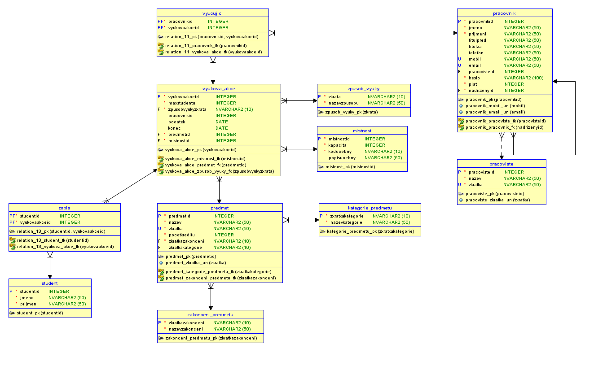

#Školní rozvrh - projekt DORDB

**Autoři:** Petr Hotovec a Petr Kůla

**Krabičák**

- Skript pro vytvoření databázového schématu

**Kůlič**

- E-R diagram
- tahle dokumentace
- testovací data do tabulky zakončení předmětu

##1. E-R diagram

##2. Slovní popis dodatečných integritních omezení
###2.1. Triviální integritiní omezení
###2.2. Netriviální integritní omezení
##3. Slovní návrh API rozhraní „business logiky“
###Zaregistrování zakazníka
###Vytoření letu
##4. Pět slovně formulovaných dotazů nad schématem
##5. Skript, který vytvoří databázové schéma odpovídající E-R diagramu
***hotovo!!!***

**Skript:** [05_db_schema.SQL](../SQL/05_db_schema.SQL)
##6. Skript, který vytvoří v databázovém schématu dodatečná integritní omezení
##7. Skript, který naplní tabulky testovacími daty
***Zatim jen zakonceni predmetu***

**Skript:** [07_testovaci_data.SQL](../SQL/07_testovaci_data.SQL)
##8. Skript, který provede postupně všechny navržené dotazy z bodu 4
##9. Skript, který se pokusí porušit všechna dodatečná integritní omezení
##10. Skript pro vytvoření balíku (package) a procedur „business logiky“
##11. Ověření procedur „business logiky“
##12. Skript, který doplní do tabulky Zakaznik automaticky dopočítávaný sloupec
##13. Skript, který vytvoří úložiště ještě jednou v „objektové“ podobě
##14. Skript, který provede pět dotazů znovu, nad objektovými tabulkami
##15. Navrhněte slovně fakta a dimenze pro datový sklad
##Skript pro vyčištění databáze