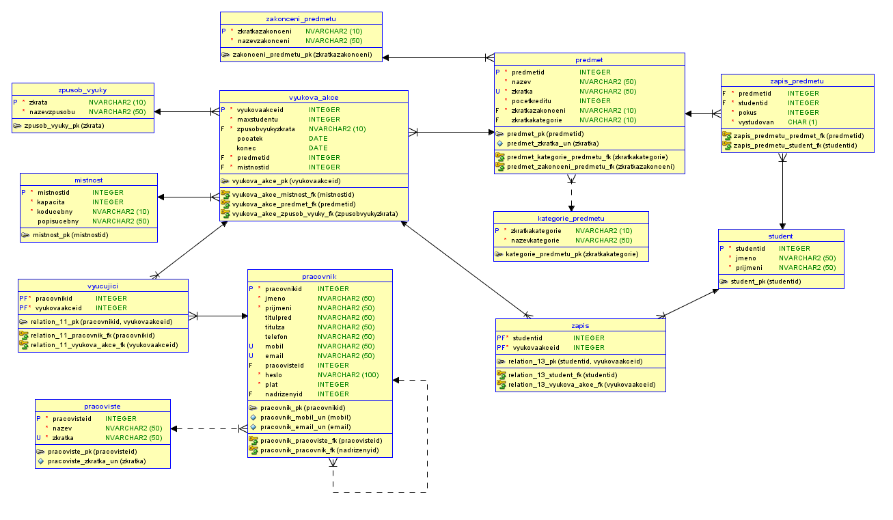

#Školní rozvrh - projekt DORDB

**Autoři:** Bc. Petr Hotovec a Bc. Petr Kůla

## Rozvrh prací ##

### Petr Kůla ###
[1] Obrázek s modelem (E-R diagram)

[4] Návrh pěti slovně formulovaných dotazů nad schématem

[7] Skript, který naplní tabulky testovacími daty

[9] Skript, který se pokusí porušit postupně všechna dodatečná integritní omezení + výstup spool z provádění tohoto skriptu (budou vidět chyby při porušení I.O.)

[12] Skript, který doplní do zvolené tabulky schématu sloupec, který bude obsahovat odvozené hodnoty (průměrný plat zaměstnance v rámci oddělní apod.) – tyto hodnoty budou automaticky aktualizovány pomocí triggerů

[13] Navrhněte fakta a dimenze (E-R diagram) pro datový sklad vycházející z vaší databáze. Přidejte i časovou dimenzi.

[14] Skript, který vytvoří databázové schéma odpovídající E-R diagramu datového skladu.

[16] Návrh dvou slovně formulovaných analytických dotazů nad datovým skladem, které povedou na agregaci faktu přes několik dimenzí za určité časové období.

### Petr Hotovec ###
[2] Slovní popis dodatečných integritních omezení

[3] Návrh API rozhraní „business logiky“ pro dva procesy, jako např. přijetí zaměstnance.

[5] Skript, který vytvoří databázové schéma odpovídající E-R diagramu

[6] Skript, který vytvoří v databázovém schématu dodatečná integritní omezení

[8] Skript (včetně výstupu spool), který provede postupně všechny navržené dotazy

[10] Skript pro vytvoření balíku (package) a procedur „business logiky“

[11] Testovací skript (včetně výstupu spool obdrženého po spuštění) pro obě procedury

[15] Skript pro jednoduchý ETL proces dat z vaši produkční databáze

[17] Skript (včetně výstupu spool), který provede postupně všechny navržené analytické dotazy.

##1. E-R diagram

##2. Slovní popis dodatečných integritních omezení

###2.1. Triviální integritiní omezení###
####Tabulka Vyukova_akce####

Atribut konec nesmí být dříve než-li atribut konec (typ DATE)
###2.2. Netriviální integritní omezení###

####Tabulka Vyukova_akce####

Nelze vytvořit vyukovou akci pro více studentů, než kolik se vejde do místnosti

####Tabulka Zapis####

Nelze zapsat více studentů na výukovou akci než je kapacita

[02\\_integritni\\_omezeni.txt](02_integritni_omezeni.txt)

##3. Slovní návrh API rozhraní „business logiky“
###Zápis studenta do předmětu###

**Název:** zapsat\_predmet

**Parametry:** studentid, predmetid

**Popis:** zapíše studenta do předmětu, před samotným vložením zkotroluje zda-li předmět již nevystudoval nebo nevyčerpal 2 možné pokusy na zápis.

###Zápis studenta na výukovou akci###

**Název:** zapsat\_vyukovou\_akci

**Parametry:** studentid, vyukovaakceid

**Popis:** procedura zapíše studenta na výukovou akci, zároveň kontroluji zda-li se student zapsal na daný předmět.

[03\\_business\\_logika.txt](03_business_logika.txt)

##4. Pět slovně formulovaných dotazů nad schématem
1. seznam všech výukových akcí urřitého studenta v určitý den
2. seznam všech pracovišť a zobrazení hiearchie každého z nich
3. 5 nejčastěji využívaných místností
4. seznam všech studentů, kteří mají zapsaný daný předmět
5. seznam všech vyučujících seřazený podle počtu hodin, které učí

[04\\_pet\\_slovne\\_form\\_dotazu.txt](04_pet_slovne_form_dotazu.txt)

##5. Skript, který vytvoří databázové schéma odpovídající E-R diagramu
**Skript:** [05\\_db\\_schema.SQL](05_db_schema.SQL)
##6. Skript, který vytvoří v databázovém schématu dodatečná integritní omezení
**Skript:** [06\\_integritni\\_omezeni\\_z\\_bodu_2.SQL](06_integritni_omezeni_z_bodu_2.SQL)
##7. Skript, který naplní tabulky testovacími daty
**Skript:** [07\\_testovaci\\_data.SQL](07_testovaci_data.SQL)
##8. Skript, který provede postupně všechny navržené dotazy z bodu 4

**Dotazy:** [08\\_dotazy\\_z\\_bodu_4.txt](08_dotazy_z_bodu_4.txt)

**Porovnání:** [08\\_porovnani.txt](08_porovnani.txt)

**Výsledek:** [08\\_vysledky\\_dotazu.txt](08_vysledky_dotazu.txt)
##9. Skript, který se pokusí porušit všechna dodatečná integritní omezení

**Skript:** [09\\_poruseni\\_omezeni.SQL](09_poruseni_omezeni.SQL)

**Výstup:** [09\\_vystup.txt](09_vystup.txt)

##10. Skript pro vytvoření balíku (package) a procedur „business logiky“

**Skript:** [10\\_balik\\_a\\_procedury.SQL](10_balik_a_procedury.SQL)

##11. Ověření procedur „business logiky“

**Skript:** [11\\_testovaci\\_skript\\_procedur.SQL](11_testovaci_skript_procedur.SQL)

**Výstup:** [11\\_vystup.txt](11_vystup.txt)

##12. Skript, který doplní do zvolené tabulky schématu dopočítávaný sloupec

**Skript:** [12\\_odvozene\\_hodnoty.SQL](12_odvozene_hodnoty.SQL)

##13. Fakta a dimenze (E-R diagram) pro datový sklad vycházející z vaší databáze##

##14. Skript, který vytvoří databázové schéma odpovídající E-R diagramu datového skladu.##

**Skript:** [14\\_er\\_schema.SQL](14_er_schema.SQL)

##15. Skript pro jednoduchý ETL proces dat z vaši produkční databáze##

**Skript:** [15\\_etl\\_proces.SQL](15_etl_proces.SQL)

##16. Návrh dvou slovně formulovaných analytických dotazů nad datovým skladem##

1. Seznam všech místností dle využití studenty za rok 2020
2. Vyucujici, ktery ucil nejvice studentu prvni pololeti roku 2021

[16\\_analyticke\\_dotazy.txt](16_analyticke_dotazy.txt)

##17. Skript (včetně výstupu spool), který provede postupně všechny navržené analytické dotazy.##

**Skript:** [17\\_skript\\_analyticke\\_dotazy.SQL](17_skript_analyticke_dotazy.SQL)
